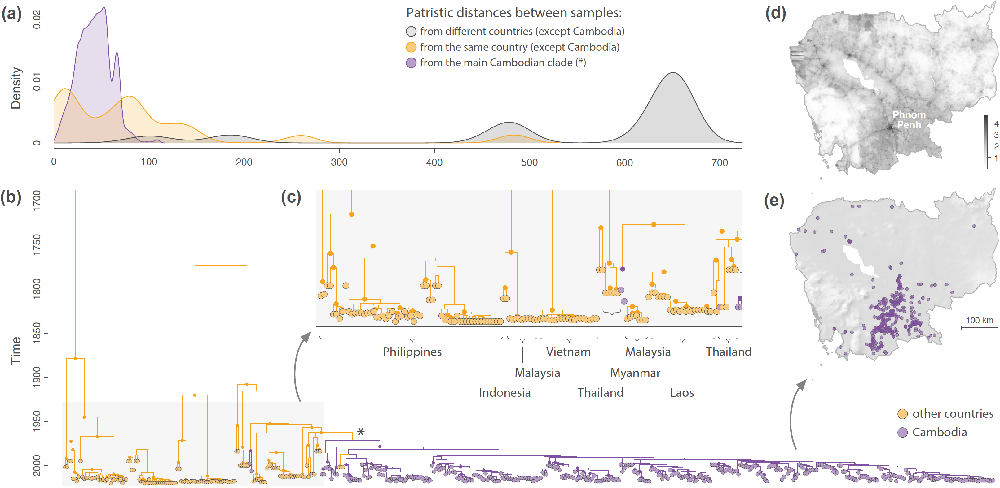

This repo gathers all the input files and scripts related to our study entitled "**Uncovering the endemic circulation of rabies in Cambodia**" ([Layan *et al*. 2023](https://onlinelibrary.wiley.com/doi/10.1111/mec.17087), *Molecular Ecology*): BEAST XML files of the discrete and continuous phylogeographic analyses, as well as R scripts and related files needed to run the samples selection step and the landscape phylogeographic analyses. Discrete and continuous phylogeographic inferences were performed with the Bayesian methods implemented in the open-source program [BEAST](http://github.com/beast-dev/beast-mcmc). Subsequent dispersal statistics estimation and landscape phylogeographic analyses were performed with R functions available in the package "[seraphim](https://github.com/sdellicour/seraphim)", using scripts gathered in the file `R_scripts_RABV_CA.r`. Accession numbers of newly sequenced whole genomes and GenBank sequences that we analysed in our study are all listed in the file "All_accession_IDs.csv". 

Abstract: In epidemiology, endemicity characterizes sustained pathogen circulation in a geographical area, which involves a circulation that is not being maintained by external introductions. Because it could potentially shape the design of public health interventions, there is an interest in fully uncovering the endemic pattern of a disease. Here, we use a phylogeographic approach to investigate the endemic signature of rabies virus (RABV) circulation in Cambodia. Cambodia is located in one of the most affected regions by rabies in the world, but RABV circulation between and within Southeast Asian countries remains understudied. Our analyses are based on a new comprehensive data set of 199 RABV genomes collected between 2014 and 2017 as well as previously published Southeast Asian RABV sequences. We show that most Cambodian sequences belong to a distinct clade that has been circulating almost exclusively in Cambodia. Our results thus point towards rabies circulation in Cambodia that does not rely on external introductions. We further characterize within-Cambodia RABV circulation by estimating lineage dispersal metrics that appear to be similar to other settings, and by performing landscape phylogeographic analyses to investigate environmental factors impacting the dispersal dynamic of viral lineages. The latter analyses do not lead to the identification of environmental variables that would be associated with the heterogeneity of viral lineage dispersal velocities, which calls for a better understanding of local dog ecology and further investigations of the potential drivers of RABV spread in the region. Overall, our study illustrates how phylogeographic investigations can be performed to assess and characterize viral endemicity in a context of relatively limited data.

**Figure: investigating the endemic signature of RABV circulation in Cambodia.** **(a)**: Comparison between patristic distances (in years) computed on the maximum clade credibility (MCC) at the inter-countries level (excluding Cambodia; in grey), at the intra-country level (excluding Cambodia; in orange), and within the main Cambodian clade (\*; in purple). **(b)**: MCC tree obtained from the preliminary discrete phylogeographic inference based on the N gene sequences and considering only two different discrete locations: ‘Cambodia’ and ‘other countries’. Tip nodes and phylogeny branches are coloured according to their sampling location and inferred ancestral location, respectively. On the MCC tree, we only highlight the internal nodes associated with a posterior probability >0.95. (\*) refers to the main Cambodian clade inferred by the discrete phylogeographic analysis, whose introduction in Cambodia is estimated to be around 1971 (95% HPD = [1963-1979]). **(c)**: Zoom on one particular part of the MCC tree corresponding to the terminal branches outside the main Cambodian clade. The country of origin of sampled sequences are displayed below the tip nodes. **(d)**: Map of log10-transformed human population density in Cambodia. **(e)**: Sampling map of all N gene sequences used for the discrete phylogeographic analysis (**n** = 354).

### System requirements

- BEAST: the program runs on any operating system and requires the installation of the BEAGLE library for fast computations (https://github.com/beagle-dev/beagle-lib). Version of BEAST used in the present study: 1.10.4
- "seraphim": the R package was mainly tested on Unix operating systems and requires the preliminary installation of several other R packages listed in the manual provided with the package

### Installation guide

- instructions to install BEAST: http://beast.community/installing
- instructions to install BEAGLE: https://github.com/beagle-dev/beagle-lib
- instructions to install "seraphim": https://github.com/sdellicour/seraphim

### Demo and instructions for use

The file `R_scripts_RABV_CA.r` gathers all the R scripts used to perform the samples selection and the different post hoc landscape phylogeographic analyses. In addition, there are also several existing tutorial allowing to perform the same analyses:
- instructions to run a continuous phylogeographic analysis in BEAST: tutorial available [here](https://beast.community/workshop_continuous_diffusion_yfv). Output: time-scaled annotated phylogenetic trees.
- instructions to estimate dispersal statistics with "seraphim": tutorial available [here](https://github.com/sdellicour/seraphim/blob/master/tutorials/Estimating_dispersal_statistics.pdf) (related example files are available in the directory with the same name). Output: estimated dispersal statistics (graphics, mean/median values, HPD intervals).
- instructions to use "seraphim" to perform relaxed random walk (RRW) simulations along posterior trees: tutorial available [here](https://github.com/sdellicour/seraphim/blob/master/tutorials/RRW_simulations_along_trees.pdf) (related example files are available in the directory with the same name). Output: spatially-annotated posterior trees along which a new RRW diffusion process has been re-simulated. These simulations are used to generate a null dispersal model, which is further exploited to test the impact of environmental factors on the dispersal location and velocity of viral lineages, as well as to test the impact of migratory bird flyways on the dispersal frequency of viral lineages.
- instructions to test the impact of environmental factors on lineage dispersal locations with "seraphim": tutorial available [here](https://github.com/sdellicour/seraphim/blob/master/tutorials/Impact_on_dispersal_direction.pdf) (related example files are available in the directory with the same name). Output: distribution of *E* statistics (see the text for further detail) and statistical support (Bayes factors) for each environmental factor.
- instructions to test the impact of environmental factors on lineage dispersal velocity with "seraphim": tutorial available [here](https://github.com/sdellicour/seraphim/blob/master/tutorials/Impact_on_dispersal_velocity.pdf) (related example files are available in the directory with the same name). Output: distribution of *Q* statistics (see the text and Appendix for further detail) and statistical support (Bayes factors) for each environmental factor.

